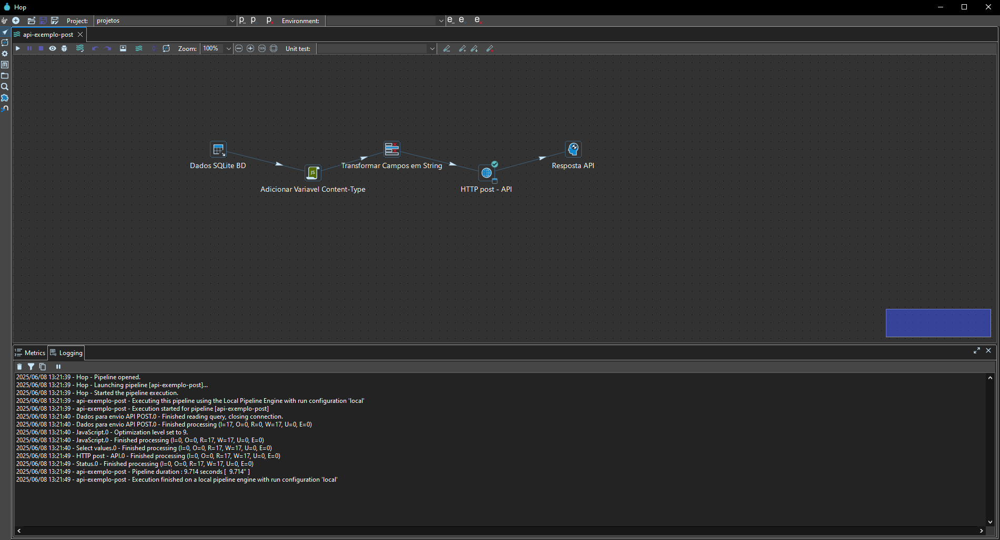
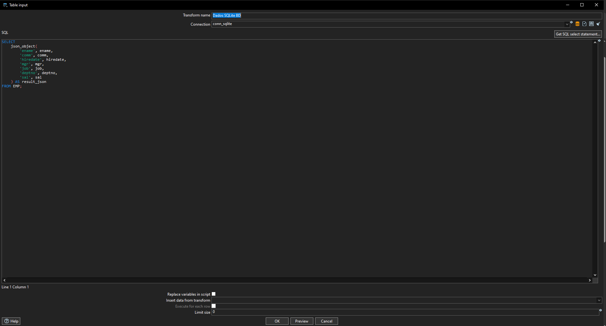
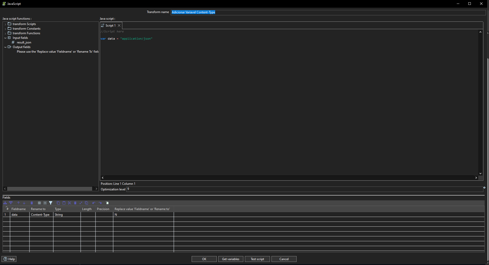
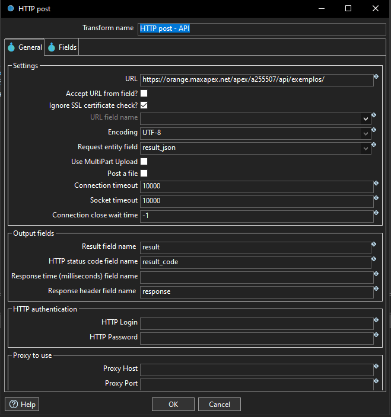
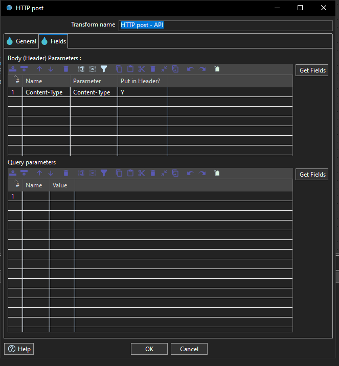
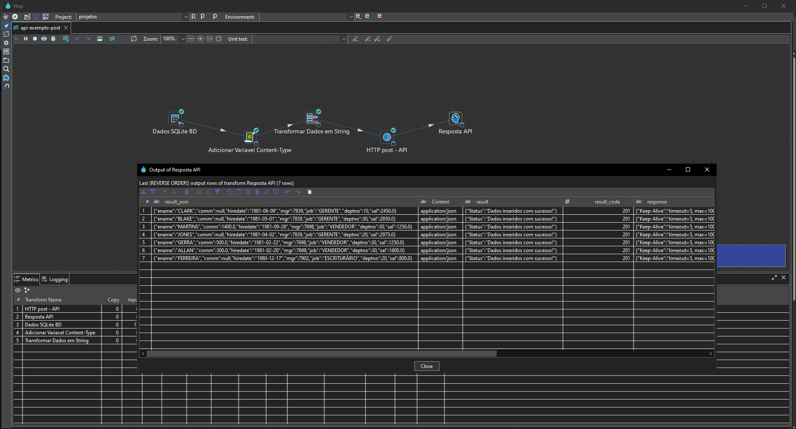
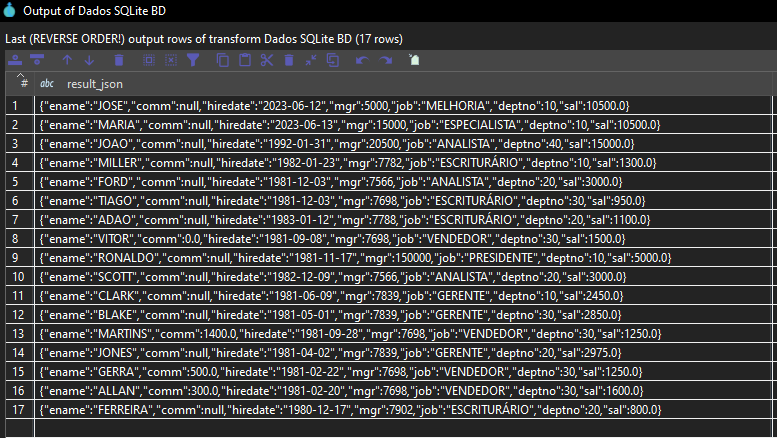

# envio-api-apache-hop
Pipeline Apache Hop para enviar dados via API REST

# Envio de Dados via API com Apache Hop

Este projeto demonstra como utilizar o Apache Hop para automatizar o envio de dados a uma API REST.

## 🛠️ Ferramentas
- Apache Hop
- Banco SQLite
- Banco Oracle
- REST API

## 🔁 Pipeline
- **Consulta SQL** → **Transformação de dados** → **Envio via HTTP POST** → **Resposta API com resultado**-

  <h3>📸 Visual do Pipeline</h3>

  

  

  

  

  

  

  

  

  

  

  

📽️ Demonstração em vídeo:
[Assista](docs/demonstracao.mkv)

## 🔗 Requisitos
- Apache Hop instalado
- Conexão com Oracle e SQLite configurada
- Endpoint da API
